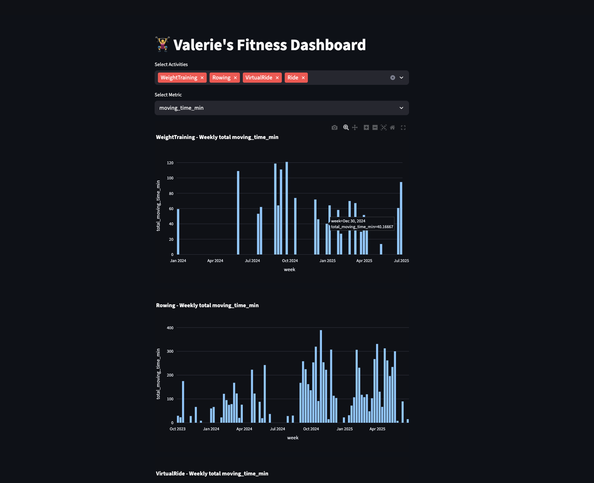
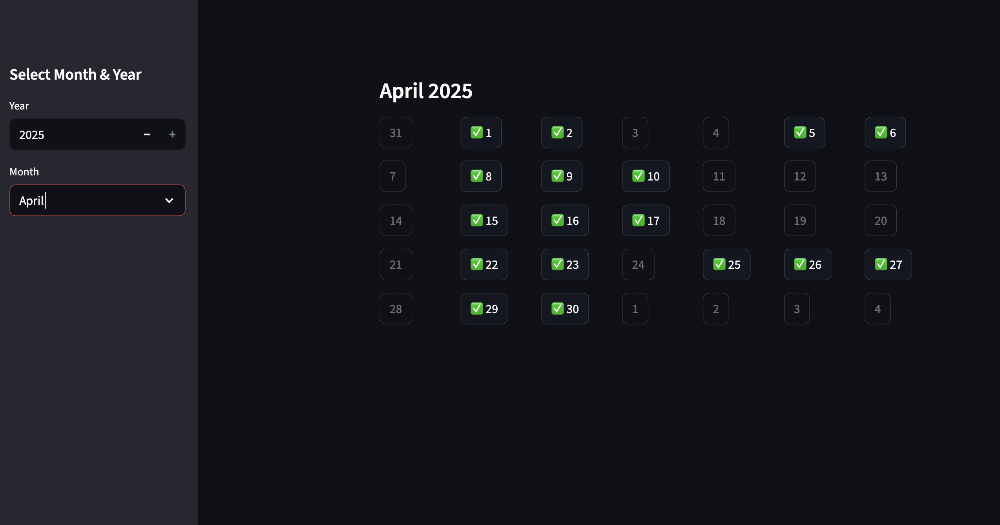
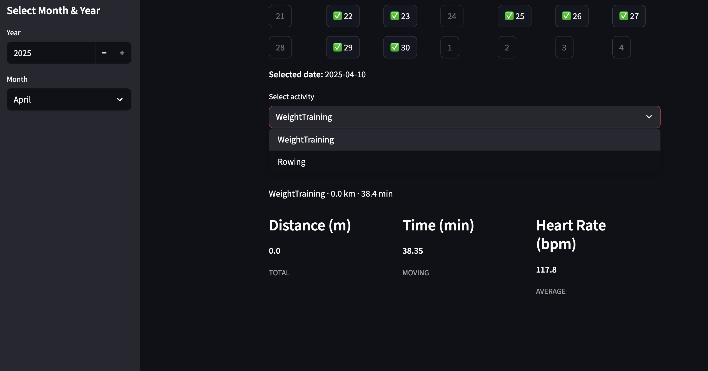
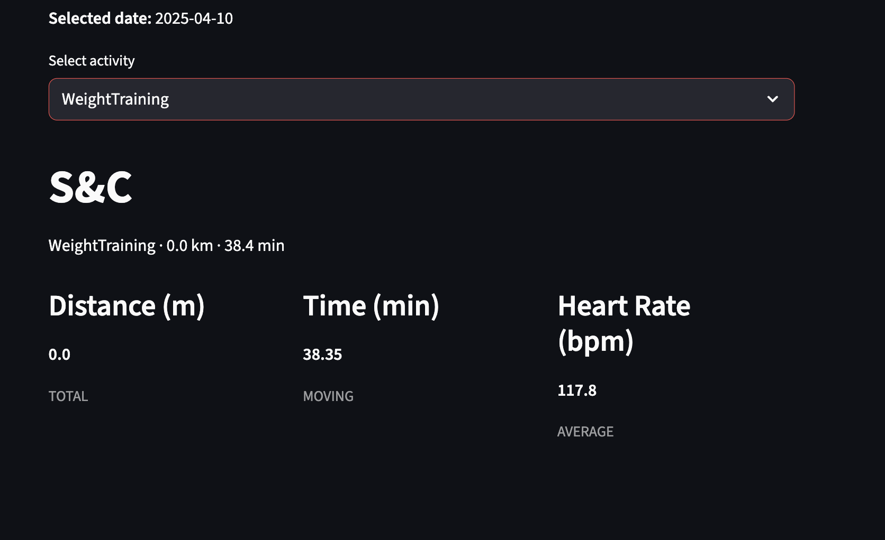

# Strava Dashboard
This dashboard has been designed for personal use to allow me to explore how to use Strava API. 

Dashboard 1
----
This dashboard is designed to get an overview of my weekly activity summaries. I can select which sports to display and which metrics to display, and then generate plots demonstrating my weekly sum of the given metric for that given sport, with the ability to select multiple activities for easier comparison.

Dashboard 2
----
This dashboard is designed to get a summary of my individual activities. I can select a day that I have done activities (which are highlighted in the calendar) and then select which activity to look at (if there are multiple on one day), and then see an analysis summary of my activity.

Choose your date of activity

Choose which activity to look at

See a summary of your stats of that activity